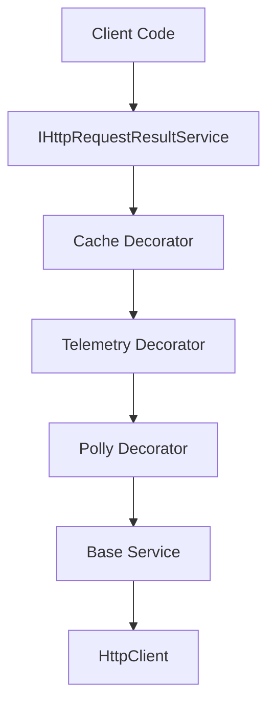

# HttpClient Decorator Pattern for .NET

<div align="center">

[](https://github.com/markhazleton/HttpClientDecoratorPattern/actions/workflows/main_httpclientdecoratorpattern.yml)
[](https://www.nuget.org/packages/WebSpark.HttpClientUtility/)
[](https://opensource.org/licenses/MIT)
[](https://dotnet.microsoft.com/download)

**Production-ready implementation of the Decorator Pattern for HttpClient with Telemetry, Caching, and Resilience**

[Live Demo](https://httpclientdecoratorpattern.azurewebsites.net/) • [Documentation](https://markhazleton.com/decorator-pattern-http-client.html) • [NuGet Package](https://www.nuget.org/packages/WebSpark.HttpClientUtility/)

</div>

---

## 📖 Table of Contents

- [Overview](#-overview)
- [Key Features](#-key-features)
- [Live Demo Pages](#-live-demo-pages)
- [Architecture](#-architecture)
- [Quick Start](#-quick-start)
- [Installation](#-installation)
- [Usage Examples](#-usage-examples)
- [WebSpark.HttpClientUtility Package](#-websparkhttpclientutility-package)
- [Configuration](#-configuration)
- [API Integration Examples](#-api-integration-examples)
- [Best Practices](#-best-practices)
- [Performance Considerations](#-performance-considerations)
- [Contributing](#-contributing)
- [License](#-license)

---

## 🎯 Overview

This repository showcases a **production-ready implementation** of the Decorator Design Pattern applied to HttpClient in .NET 10. It demonstrates how to enhance HTTP operations with cross-cutting concerns while maintaining clean, maintainable, and testable code.

The project serves as both a **reference implementation** and a **live demonstration** of the [WebSpark.HttpClientUtility](https://www.nuget.org/packages/WebSpark.HttpClientUtility/) NuGet package, providing practical examples of how to implement robust HTTP clients in enterprise applications.

### Why This Pattern?

Traditional approaches to adding functionality to HttpClient often result in:
- ❌ Tightly coupled code
- ❌ Difficult to test components
- ❌ Violation of Single Responsibility Principle
- ❌ Hard-to-maintain implementations

The Decorator Pattern solves these issues by:
- ✅ Adding behavior dynamically without modifying existing code
- ✅ Composing functionality through layering
- ✅ Adhering to SOLID principles
- ✅ Enabling easy testing through dependency injection
- ✅ Providing clear separation of concerns

---

## ⭐ Key Features

### 🔍 **Telemetry & Observability**
- Automatic request/response timing metrics
- Request and response size tracking
- Correlation ID propagation for distributed tracing
- Detailed structured logging with telemetry data
- Performance monitoring for all HTTP operations

### ⚡ **Performance Optimization**
- **Smart Memory Caching**: Configurable cache duration per request
- **Cache Hit/Miss Tracking**: Monitor cache effectiveness
- **Response Size Optimization**: Track and analyze payload sizes
- **Concurrent Request Management**: SemaphoreSlim for controlled parallelism

### 🛡️ **Resilience & Reliability**
- **Circuit Breaker Pattern**: Prevent cascading failures during service outages
- **Retry Policies**: Configurable retry with exponential backoff
- **Timeout Management**: Request-level timeout configuration
- **Polly Integration**: Full support for Polly resilience policies

### 🎨 **Modern UI & Themes**
- **Bootswatch Integration**: 26+ Bootstrap themes with live switching
- **Responsive Design**: Mobile-first, fully responsive interface
- **Real-time Theme Preview**: Instant theme changes without page reload
- **Professional Layout**: Clean, modern UI following best practices

### 🔧 **Developer Experience**
- **Clean Architecture**: Clear separation of concerns
- **Dependency Injection**: Full DI support throughout
- **Strongly Typed Models**: Type-safe request/response handling
- **Comprehensive Examples**: Multiple real-world API integrations
- **Production Ready**: Battle-tested patterns and practices

---

## 🌐 Live Demo Pages

The demonstration application includes several interactive examples:

| Page | Description | Key Features |
|------|-------------|--------------|
| **🎭 Joke API** | Simple GET request demonstration | Basic API consumption, telemetry tracking |
| **🎨 Art Institute** | Complex data retrieval with caching | Image handling, large datasets, cache effectiveness |
| **🚀 NASA Picture of the Day** | Image API integration | Daily API quota, caching strategies, media handling |
| **📊 Circuit Breaker** | Resilience pattern demonstration | Failure handling, circuit state management, recovery |
| **🔄 Concurrent Calls** | Parallel request handling | SemaphoreSlim usage, performance optimization, throttling |
| **🕷️ Domain Crawler** | Web crawling with SignalR | Real-time updates, progress tracking, link discovery |
| **📚 Documentation** | Interactive package documentation | API reference, usage examples, configuration guide |

Each page demonstrates different aspects of the decorator pattern and includes detailed telemetry information showing the benefits of the implementation.

---

## 🏗️ Architecture

### The Decorator Pattern in Action



### Core Components

#### 1. **Service Interface** (from WebSpark.HttpClientUtility)

```csharp
public interface IHttpRequestResultService
{
    Task<HttpRequestResult<T>> HttpSendRequestResultAsync<T>(
        HttpRequestResult<T> requestResult,
        CancellationToken ct = default);
}
```

#### 2. **Request/Response Container**

```csharp
public class HttpRequestResult<T>
{
    public string RequestPath { get; set; }                    // API endpoint
    public T? ResponseResults { get; set; }                    // Parsed response
    public int CacheDurationMinutes { get; set; }              // Cache TTL
    public bool IsCached { get; set; }                         // Cache status
    public TimeSpan RequestDuration { get; set; }              // Request time
    public long ResponseSizeBytes { get; set; }                // Response size
    public string CorrelationId { get; set; }                  // Tracking ID
    public bool IsSuccess { get; set; }                        // Success flag
    public HttpStatusCode StatusCode { get; set; }             // HTTP status
    public string? ErrorMessage { get; set; }                  // Error details
}
```

#### 3. **Decorator Chain Implementation**

The decorators are layered in a specific order to maximize effectiveness:

```csharp
builder.Services.AddSingleton<IHttpRequestResultService>(serviceProvider =>
{
    // 1. Base Service - Handles actual HTTP communication
    IHttpRequestResultService baseService = new HttpRequestResultService(
        serviceProvider.GetRequiredService<ILogger<HttpRequestResultService>>(),
        serviceProvider.GetRequiredService<IConfiguration>(),
        serviceProvider.GetRequiredService<IHttpClientFactory>()
            .CreateClient("HttpClientDecorator")
    );

    // 2. Polly Decorator - Adds retry and circuit breaker policies
    var pollyOptions = serviceProvider.GetRequiredService<IConfiguration>()
        .GetSection("HttpRequestResultPollyOptions")
        .Get<HttpRequestResultPollyOptions>();

    IHttpRequestResultService pollyService = new HttpRequestResultServicePolly(
        serviceProvider.GetRequiredService<ILogger<HttpRequestResultServicePolly>>(),
        baseService,
        pollyOptions
    );

    // 3. Telemetry Decorator - Adds performance tracking
    IHttpRequestResultService telemetryService = new HttpRequestResultServiceTelemetry(
        serviceProvider.GetRequiredService<ILogger<HttpRequestResultServiceTelemetry>>(),
        pollyService
    );

    // 4. Cache Decorator - Adds response caching (outermost layer)
    IHttpRequestResultService cacheService = new HttpRequestResultServiceCache(
        telemetryService,
        serviceProvider.GetRequiredService<ILogger<HttpRequestResultServiceCache>>(),
        serviceProvider.GetRequiredService<IMemoryCache>()
    );

    return cacheService; // Return the fully decorated service
});
```

### Why This Order Matters

1. **Cache First** (outermost): Check cache before doing any work
2. **Telemetry Second**: Track all operations, even cached ones
3. **Polly Third**: Apply resilience policies to actual HTTP calls
4. **Base Last** (innermost): Execute the actual HTTP request

---

## 🚀 Quick Start

### Prerequisites

- **.NET 10 SDK** or later ([Download](https://dotnet.microsoft.com/download/dotnet/10.0))
- **Visual Studio 2022** (v17.12+) or **Visual Studio Code**
- **Git** for cloning the repository

### Clone and Run

```bash
# Clone the repository
git clone https://github.com/markhazleton/HttpClientDecoratorPattern.git

# Navigate to the project directory
cd HttpClientDecoratorPattern

# Restore dependencies
dotnet restore

# Build the solution
dotnet build

# Run the web application
cd HttpClientDecorator.Web
dotnet run

# Open browser to https://localhost:5001
```

The application will launch and be available at `https://localhost:5001` (or the port shown in the console).

---

## 📦 Installation

### Using the NuGet Package in Your Own Projects

#### Via .NET CLI
```bash
dotnet add package WebSpark.HttpClientUtility
```

#### Via Package Manager Console
```powershell
Install-Package WebSpark.HttpClientUtility
```

#### Via PackageReference (in .csproj)
```xml
<PackageReference Include="WebSpark.HttpClientUtility" Version="1.0.5" />
```

### Additional Dependencies

The package has minimal dependencies:
- `Microsoft.Extensions.Caching.Abstractions`
- `Microsoft.Extensions.Http`
- `Microsoft.Extensions.Logging.Abstractions`
- `Polly` (for resilience policies)

---

## 💡 Usage Examples

### Basic Usage

```csharp
public class WeatherService
{
    private readonly IHttpRequestResultService _httpService;

    public WeatherService(IHttpRequestResultService httpService)
    {
        _httpService = httpService;
    }

    public async Task<WeatherData?> GetWeatherAsync(string city)
    {
        var request = new HttpRequestResult<WeatherData>
        {
            RequestPath = $"https://api.weather.com/v3/weather?city={city}",
            CacheDurationMinutes = 15 // Cache for 15 minutes
        };

        var result = await _httpService.HttpSendRequestResultAsync(request);

        if (result.IsSuccess)
        {
            Console.WriteLine($"Request took: {result.RequestDuration.TotalMilliseconds}ms");
            Console.WriteLine($"Cached: {result.IsCached}");
            Console.WriteLine($"Response size: {result.ResponseSizeBytes} bytes");

            return result.ResponseResults;
        }

        Console.WriteLine($"Error: {result.ErrorMessage}");
        return null;
    }
}
```

### With Custom Headers

```csharp
var request = new HttpRequestResult<ApiResponse>
{
    RequestPath = "https://api.example.com/data",
    CacheDurationMinutes = 0, // Don't cache
    HttpMethod = HttpMethod.Post,
    RequestBody = JsonSerializer.Serialize(new { query = "search term" })
};

// Custom headers are set up in HttpClient configuration
var result = await _httpService.HttpSendRequestResultAsync(request);
```

### Concurrent Requests with SemaphoreSlim

```csharp
public class DataAggregatorService
{
    private readonly IHttpRequestResultService _httpService;
    private readonly SemaphoreSlim _semaphore = new(10, 10); // Max 10 concurrent

    public async Task<List<TResult>> GetMultipleAsync<TResult>(
        List<string> urls,
        CancellationToken ct = default)
    {
        var tasks = urls.Select(async url =>
        {
            await _semaphore.WaitAsync(ct);
            try
            {
                var request = new HttpRequestResult<TResult>
                {
                    RequestPath = url,
                    CacheDurationMinutes = 5
                };

                var result = await _httpService
                    .HttpSendRequestResultAsync(request, ct);

                return result.ResponseResults;
            }
            finally
            {
                _semaphore.Release();
            }
        });

        var results = await Task.WhenAll(tasks);
        return results.Where(r => r != null).ToList()!;
    }
}
```

### Custom Decorator

You can create your own decorators:

```csharp
public class CustomLoggingDecorator : IHttpRequestResultService
{
    private readonly IHttpRequestResultService _decoratedService;
    private readonly ILogger _logger;

    public CustomLoggingDecorator(
        IHttpRequestResultService decoratedService,
        ILogger<CustomLoggingDecorator> logger)
    {
        _decoratedService = decoratedService;
        _logger = logger;
    }

    public async Task<HttpRequestResult<T>> HttpSendRequestResultAsync<T>(
        HttpRequestResult<T> requestResult,
        CancellationToken ct = default)
    {
        _logger.LogInformation(
            "Making request to {Url} at {Time}",
            requestResult.RequestPath,
            DateTime.UtcNow);

        var result = await _decoratedService
            .HttpSendRequestResultAsync(requestResult, ct);

        _logger.LogInformation(
            "Request completed. Success: {Success}, Duration: {Duration}ms",
            result.IsSuccess,
            result.RequestDuration.TotalMilliseconds);

        return result;
    }
}
```

---

## 🔧 Configuration

### appsettings.json

```json
{
  "Logging": {
    "LogLevel": {
      "Default": "Information",
      "Microsoft.AspNetCore": "Warning",
      "WebSpark.HttpClientUtility": "Information"
    }
  },
  "HttpRequestResultPollyOptions": {
    "RetryCount": 3,
    "RetryDelayMilliseconds": 1000,
    "CircuitBreakerFailureThreshold": 5,
    "CircuitBreakerSamplingDurationSeconds": 60,
    "CircuitBreakerMinimumThroughput": 10,
    "CircuitBreakerDurationOfBreakSeconds": 30,
    "TimeoutSeconds": 30
  },
  "AllowedHosts": "*"
}
```

### HttpClient Configuration

```csharp
builder.Services.AddHttpClient("HttpClientDecorator", client =>
{
    client.Timeout = TimeSpan.FromSeconds(30);
    client.DefaultRequestHeaders.Add("Accept", "application/json");
    client.DefaultRequestHeaders.Add("User-Agent", "YourAppName/1.0");
    client.DefaultRequestHeaders.Add("X-Request-Source", "YourAppName");
})
.ConfigurePrimaryHttpMessageHandler(() => new HttpClientHandler
{
    AllowAutoRedirect = true,
    MaxAutomaticRedirections = 10,
    AutomaticDecompression = DecompressionMethods.GZip | DecompressionMethods.Deflate
});
```

---

## 🔌 API Integration Examples

This project demonstrates integration with several public APIs:

### 1. JokeAPI (v2.jokeapi.dev)
- **Purpose**: Demonstrate simple GET requests with telemetry
- **Features**: Safe-mode jokes, multiple joke types
- **Cache Strategy**: No caching (fresh jokes each time)

### 2. Art Institute of Chicago API
- **Purpose**: Complex data structures and image handling
- **Features**: Pagination, image URLs, metadata
- **Cache Strategy**: 30-minute cache for artwork data

### 3. NASA Astronomy Picture of the Day (APOD)
- **Purpose**: Media handling and daily content
- **Features**: Image URLs, descriptions, dates
- **Cache Strategy**: 24-hour cache (updates daily)

### 4. Custom Circuit Breaker Test Endpoint
- **Purpose**: Demonstrate resilience patterns
- **Features**: Controlled failures, circuit state visualization
- **Cache Strategy**: No caching (testing resilience)

---

## 🎯 Best Practices

### ✅ DO

1. **Use appropriate cache durations** based on data freshness requirements
2. **Set reasonable timeouts** to prevent hanging requests
3. **Implement proper cancellation token handling** for responsive applications
4. **Monitor telemetry data** to identify performance bottlenecks
5. **Use SemaphoreSlim** for controlling concurrent API calls
6. **Configure circuit breakers** based on your API's characteristics
7. **Log correlation IDs** for distributed tracing
8. **Handle errors gracefully** and provide meaningful error messages

### ❌ DON'T

1. **Don't cache error responses** - let failures fail fast
2. **Don't ignore cancellation tokens** - respect user cancellations
3. **Don't use overly aggressive retry policies** - respect API rate limits
4. **Don't cache sensitive data** without encryption
5. **Don't ignore HTTP status codes** - handle different scenarios appropriately
6. **Don't create new HttpClient instances** per request - use IHttpClientFactory
7. **Don't forget to dispose** of resources properly
8. **Don't hardcode configuration** - use appsettings.json

---

## 📊 Performance Considerations

### Memory Usage

- **Cache Size**: Monitor memory cache size and set appropriate eviction policies
- **Response Objects**: Large responses impact memory; consider streaming for large payloads
- **Concurrent Requests**: Each request consumes memory; use SemaphoreSlim to limit concurrency

### Optimization Tips

1. **Cache Effectively**
   ```csharp
   // Cache frequently accessed, slowly changing data
   request.CacheDurationMinutes = 60; // 1 hour for stable data

   // Don't cache dynamic data
   request.CacheDurationMinutes = 0; // Real-time data
   ```

2. **Use Compression**
   ```csharp
   AutomaticDecompression = DecompressionMethods.GZip | DecompressionMethods.Deflate
   ```

3. **Limit Concurrent Requests**
   ```csharp
   private readonly SemaphoreSlim _semaphore = new(20, 20); // Max 20 concurrent
   ```

4. **Set Appropriate Timeouts**
   ```csharp
   client.Timeout = TimeSpan.FromSeconds(30); // Prevent hanging
   ```

### Monitoring Metrics

Track these key performance indicators:
- **Request Duration**: Average, P95, P99 response times
- **Cache Hit Rate**: Percentage of requests served from cache
- **Error Rate**: Failed requests / Total requests
- **Circuit Breaker State**: Open/Closed/Half-Open states
- **Response Sizes**: Track bandwidth usage

---

## 🤝 Contributing

We welcome contributions! Here's how you can help:

### Reporting Issues

Found a bug or have a feature request? Please [open an issue](https://github.com/markhazleton/HttpClientDecoratorPattern/issues/new) with:
- Clear description of the issue
- Steps to reproduce
- Expected vs actual behavior
- Environment details (.NET version, OS, etc.)
- Screenshots if applicable

### Pull Requests

1. **Fork** the repository
2. **Create** a feature branch (`git checkout -b feature/amazing-feature`)
3. **Make** your changes
4. **Test** thoroughly (add unit tests if applicable)
5. **Commit** with clear messages (`git commit -m 'Add amazing feature'`)
6. **Push** to your fork (`git push origin feature/amazing-feature`)
7. **Open** a Pull Request

Please ensure:
- ✅ Code follows existing style conventions
- ✅ All tests pass
- ✅ Documentation is updated
- ✅ Commit messages are descriptive

See [CONTRIBUTING.md](CONTRIBUTING.md) for detailed guidelines.

---

## 📚 Additional Resources

### Documentation
- [Blog Post: Decorator Pattern for HttpClient](https://markhazleton.com/decorator-pattern-http-client.html)
- [WebSpark.HttpClientUtility on NuGet](https://www.nuget.org/packages/WebSpark.HttpClientUtility/)
- [Live Demo Application](https://httpclientdecoratorpattern.azurewebsites.net/)

### Related Patterns
- [Decorator Pattern (Gang of Four)](https://refactoring.guru/design-patterns/decorator)
- [Circuit Breaker Pattern](https://docs.microsoft.com/en-us/azure/architecture/patterns/circuit-breaker)
- [Retry Pattern](https://docs.microsoft.com/en-us/azure/architecture/patterns/retry)

### Microsoft Documentation
- [IHttpClientFactory](https://docs.microsoft.com/en-us/dotnet/architecture/microservices/implement-resilient-applications/use-httpclientfactory-to-implement-resilient-http-requests)
- [Polly Resilience Framework](https://github.com/App-vNext/Polly)
- [.NET Dependency Injection](https://docs.microsoft.com/en-us/dotnet/core/extensions/dependency-injection)

---

## 🏆 Project Stats

- **Built with**: .NET 10.0 LTS
- **Language**: C# 13
- **Architecture**: ASP.NET Core Razor Pages
- **Pattern**: Decorator Pattern (GoF)
- **Hosting**: Azure App Service
- **CI/CD**: GitHub Actions
- **Testing**: Real-world API integrations

---

## 📄 License

This project is licensed under the **MIT License** - see the [LICENSE](LICENSE) file for details.

```
MIT License

Copyright (c) 2024 Mark Hazleton

Permission is hereby granted, free of charge, to any person obtaining a copy
of this software and associated documentation files (the "Software"), to deal
in the Software without restriction, including without limitation the rights
to use, copy, modify, merge, publish, distribute, sublicense, and/or sell
copies of the Software, and to permit persons to whom the Software is
furnished to do so, subject to the following conditions:

The above copyright notice and this permission notice shall be included in all
copies or substantial portions of the Software.
```

---

## 👤 Author

**Mark Hazleton**

- Website: [markhazleton.com](https://markhazleton.com)
- GitHub: [@markhazleton](https://github.com/markhazleton)
- LinkedIn: [Mark Hazleton](https://www.linkedin.com/in/markhazleton/)

---

## 🌟 Show Your Support

If this project helped you, please consider:

- ⭐ **Starring** the repository
- 🐛 **Reporting issues** you encounter
- 💡 **Suggesting new features**
- 📢 **Sharing** with others who might benefit
- 🤝 **Contributing** to make it even better

---

## 🔄 Project Status

✅ **Actively Maintained** - This project is under active development and maintenance.

- Regular updates for new .NET versions
- Security patches applied promptly
- Feature enhancements based on community feedback
- Bug fixes and improvements ongoing

**Latest Update**: January 2026 - Upgraded to .NET 10.0 LTS

---

<div align="center">

**[⬆ Back to Top](#httpclient-decorator-pattern-for-net)**

Made with ❤️ by [Mark Hazleton](https://markhazleton.com)

</div>
